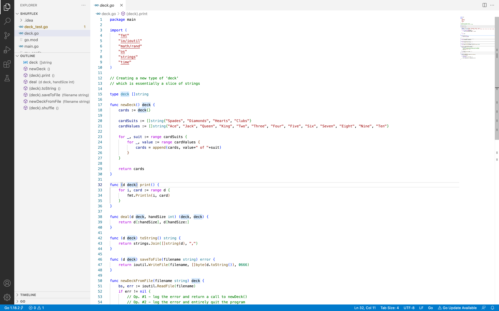

# ShuffleX
This Go package provides a simulation of a standard 52-card deck, offering various functions to manipulate and interact with the deck. It includes essential operations such as:
newDeck – Creates a new deck of 52 cards.
print – Displays the deck contents.
shuffle – Randomly shuffles the deck.
deal – Splits the deck into hands.
saveToDeck – Saves the deck to a file.
newDeckFromFile – Loads a deck from a file.
Additionally, the package includes well-structured unit tests in Golang to ensure the correctness of all functionalities.

🚀 Perfect for learning Go, practicing TDD, or building card-based applications!

You can use all functions defined in the file deck.go at main.go when you run ShuffleX.
